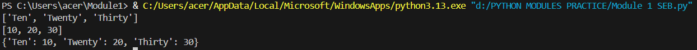
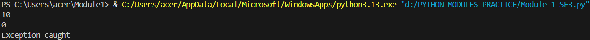
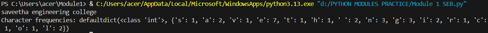
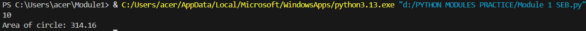
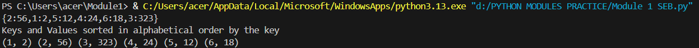

# EX NO 4(a)
## 🎯 Aim
To write a Python program to convert them into a dictionary in a way that item from list1 is the key and item from list2 is the value

## 🧠 Algorithm
1. Get two list as input using eval()
2. Using for loop traverse both the lists and convert them into dictionary.

## 💻 Program
```
list1=eval(input())
list2=eval(input())
d=dict()
for i in range (len(list1)):
    d[list1[i]]=list2[i]
print(d)
    
```

## Output


## Result
Thus a python program to convert two lists into a dictionary has been written and executed successfully.

# EX NO 4(b)
## 🎯 Aim
To write a python program for solving the following error:
1. program should takes two numbers as input and divide
2. if the second number is not zero then it should print result of a/b.
3. if the second number is zero then it should print "Exception caught"

## 🧠 Algorithm
1. Get two numbers as input from the user.
2. Divide the two numbers within try-except block.

## 💻 Program
```
a=int(input())
b=int(input())
try:
    print(a/b)
except:
    print("Exception caught")

```

## Output


## Result
Thus a python program for solving the above error has been written and executed successfully.

# EX NO 4(c)
## 🎯 Aim
To write a Python program to read a file and count the frequency of each character in it.

## 🧠 Algorithm
1. Define `create_file` method for creating a file
2. Define `char_frequency` method for finding the frequency of each letter.
3. Get a string as input and print the frequency of each character.

## 💻 Program
```
from collections import defaultdict
def create_file(file_path, content):
    with open(file_path, 'w') as file:
        file.write(content)

# Function to calculate character frequencies
def char_frequency(file_path):
    a=open(file_path,"r")
    dict1={}
    b=a.read()
    for i in b:
        c=b.count(i)
        dict1[i]=c
    return (defaultdict(int,dict1))
file_path = 'example.txt'
file_content = input()
create_file(file_path, file_content)
print("Character frequencies:", char_frequency(file_path))
```

## Output


## Result
Thus a python program to read a file and count the frequency of each character in it has been written and executed successfully.

# EX NO 4(d)
## 🎯 Aim
To write Python Program to take the radius from the user and find the area of the circle using class name 'saveetha' and function name 'slot'

## 🧠 Algorithm
1. Create a class named `saveetha`.
2. Define a function named `slot` to find the area of the circle


## 💻 Program
```
import math
class saveetha:
    def slot(self,r):
        return r*r*math.pi
a=int(input())
s=saveetha()
print("Area of circle:",round(s.slot(a),2))
```

## Output


## Result
Thus a python program to find the area of the circle using class has been written and executed successfully.


# EX NO 4(e)
## 🎯 Aim
To write a python program to Sorting the Keys and Values in Alphabetical Order using the Key in Dictionary.

## 🧠 Algorithm
1. Get a Dictionary as input from the user.
2. Using for loop sort the elements and convert each key value pair as a nested tuple.
3. Traverse the tuple using for loop and print the elements.


## 💻 Program
```
a=eval(input())
list1=[(i,a[i]) for i in range(1,7)]
print("Keys and Values sorted in alphabetical order by the key")
for i in list1:
    print(i,end=" ")
```

## Output


## Result
Thus a python program to Sort the key and values in Alphabetical Order using the key in Dictionary has been written and executed successfully.


